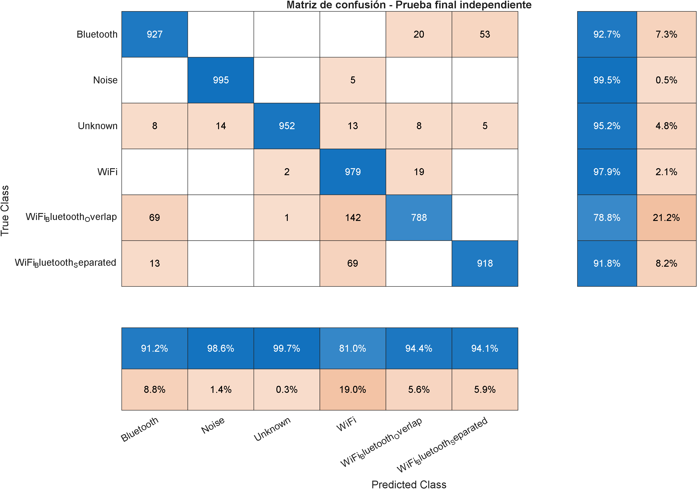
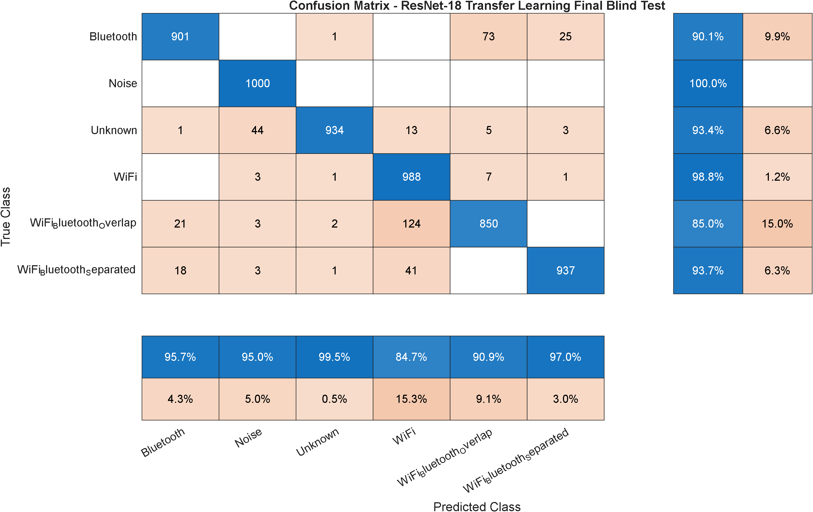
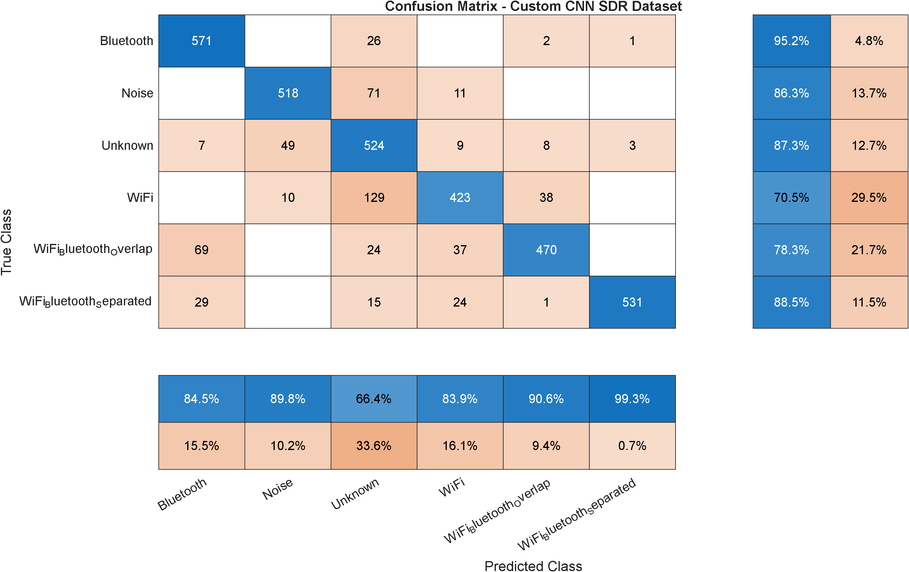
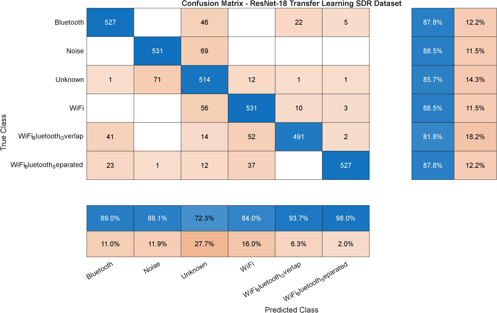

# RF Signal Classification Using AI: WiFi and Bluetooth Coexistence

This repository contains a MATLAB deep-learning workflow for classifying RF activity from spectrogram images. The system identifies WiFi, Bluetooth, coexistence conditions, noise, and unknown RF-like activity from complex I/Q observations.

Two classifiers are included:

1. A custom convolutional neural network trained from scratch.
2. A ResNet-18 transfer-learning model fine-tuned for RF spectrogram classification.

The reported workflow uses synthetic waveform generation, domain randomization, an independent blind test, and a second synthetic receiver-like validation set with stronger acquisition-inspired impairments.

---

## 1. Project objective

The objective is to classify a complete RF observation window into one of six classes:

| Class | Description |
| --- | --- |
| `Bluetooth` | Bluetooth Low Energy activity with variable frequency position and RF impairments. |
| `Noise` | Complex receiver-like noise, including colored noise, DC offset, bursts, and weak tones. |
| `Unknown` | Synthetic RF-like activity outside the target WiFi and Bluetooth classes. |
| `WiFi` | WLAN waveform generated with MATLAB WLAN functions. |
| `WiFi_Bluetooth_Overlap` | WiFi and Bluetooth signals occupying overlapping or nearby spectral regions. |
| `WiFi_Bluetooth_Separated` | WiFi and Bluetooth signals present in the same observation but separated in frequency. |

The classifier performs image-level classification. Each spectrogram receives one class label; the project does not perform pixel-level segmentation.

---

## 2. Processing workflow

```text
Synthetic I/Q waveform generation
        ↓
Domain randomization and RF impairments
        ↓
224 × 224 spectrogram generation
        ↓
Custom CNN and ResNet-18 training
        ↓
Independent synthetic blind test
        ↓
Independent synthetic receiver-like validation
        ↓
Accuracy, precision, recall, F1-score, and confusion matrices
```

The receiver-like stage is intentionally more difficult than the training distribution. It is designed to test robustness under acquisition-inspired changes, not to represent measured hardware captures.

---

## 3. Dataset design

| Dataset | Type | Classes | Samples per class | Total | Purpose |
| --- | --- | ---: | ---: | ---: | --- |
| `spectrograms_v3_domain_randomized` | Synthetic | 6 | 3,000 | 18,000 | Training, validation, and internal testing |
| `blind_test_v2_final` | Synthetic and independently generated | 6 | 1,000 | 6,000 | Final blind-test evaluation |
| Receiver-like validation set | Synthetic and independently generated | 6 | 600 | 3,600 | Robustness evaluation with receiver-inspired impairments |

### 3.1 Training dataset

The training dataset applies randomized RF effects so that the classifiers learn general time-frequency patterns rather than fixed spectral positions.

Implemented variations include:

- Additive noise and randomized SNR.
- Frequency and phase offsets.
- Amplitude and relative-power changes.
- Multipath effects.
- IQ imbalance and DC offset.
- Colored noise, bursts, and weak spurious tones.
- Time shifts.
- Continuous Bluetooth and unknown-signal displacement.

### 3.2 Independent blind test

The blind-test set is generated separately with a different random seed and is not used during training. It provides the principal independent evaluation of the two trained models.

### 3.3 Receiver-like validation

The 3,600-image receiver-like set is also synthetic and independent from training. Its metadata may contain known SNR values, programmed frequency offsets, gain values, and other simulation parameters because these values are controlled during generation.

This validation stage represents receiver-inspired conditions such as:

- Wider SNR variation.
- Frequency-position changes.
- Simulated gain variation.
- IQ and DC impairments.
- Channel and noise changes.
- Weak bursts and spurious components.

The reported receiver-like results do not claim hardware measurement performance.

---

## 4. Spectrogram representation

Each complex I/Q segment is converted into a normalized spectrogram image of:

```text
224 × 224 pixels
```

The representation preserves:

- Time-frequency occupancy.
- Occupied bandwidth.
- Relative frequency displacement.
- Spectral overlap and separation.
- Noise-like structures.
- Unknown RF patterns.

The custom CNN uses grayscale images. ResNet-18 receives the same spectrograms converted from grayscale to RGB during preprocessing.

---

## 5. WiFi and Bluetooth coexistence synthesis

For coexistence classes, the WiFi and Bluetooth waveforms are:

1. Resampled to a common sampling rate.
2. Shifted explicitly in complex baseband.
3. Normalized independently.
4. Combined with randomized relative power.
5. Passed through the impairment stage.

The initial design considered `comm.MultibandCombiner`. The final implementation uses explicit complex frequency translation and baseband addition instead. This provides direct control over overlap, separation, and relative signal power.

---

## 6. Models

### 6.1 Custom CNN baseline

Model file:

```text
models/cnn_wifi_bluetooth_v3_domain_randomized.mat
```

Training script:

```matlab
run("matlab/step02_train_cnn_wifi_bluetooth.m")
```

Blind-test evaluation:

```matlab
run("matlab/step05_evaluate_blind_test.m")
```

Receiver-like evaluation:

```matlab
run("matlab/step06a_evaluate_cnn_sdr_dataset.m")
```

### 6.2 ResNet-18 transfer learning

Model file:

```text
models/resnet18_transfer_learning_wifi_bluetooth.mat
```

Training script:

```matlab
run("matlab/step02b_train_transfer_learning_wifi_bluetooth.m")
```

Blind-test evaluation:

```matlab
run("matlab/step05b_evaluate_transfer_learning_blind_test.m")
```

Receiver-like evaluation:

```matlab
run("matlab/step06_evaluate_transfer_learning_sdr_dataset.m")
```

The evaluation script filenames retain `sdr_dataset` for backward compatibility. In this repository, those scripts evaluate the synthetic receiver-like set; they do not imply that the reported samples were captured with SDR hardware.

---

## 7. Main results

| Model | Independent blind test | Receiver-like validation |
| --- | ---: | ---: |
| Custom CNN baseline | 92.65% | 84.36% |
| ResNet-18 transfer learning | 93.50% | 86.69% |

ResNet-18 improves the blind-test accuracy by 0.85 percentage points and the receiver-like accuracy by 2.33 percentage points over the custom CNN baseline.

### 7.1 Custom CNN blind-test metrics

| Class | Precision | Recall | F1-score |
| --- | ---: | ---: | ---: |
| Bluetooth | 0.9115 | 0.9270 | 0.9192 |
| Noise | 0.9861 | 0.9950 | 0.9905 |
| Unknown | 0.9969 | 0.9520 | 0.9739 |
| WiFi | 0.8104 | 0.9790 | 0.8868 |
| WiFi_Bluetooth_Overlap | 0.9437 | 0.7880 | 0.8589 |
| WiFi_Bluetooth_Separated | 0.9406 | 0.9180 | 0.9292 |



### 7.2 ResNet-18 blind-test metrics

| Class | Precision | Recall | F1-score |
| --- | ---: | ---: | ---: |
| Bluetooth | 0.9575 | 0.9010 | 0.9284 |
| Noise | 0.9497 | 1.0000 | 0.9742 |
| Unknown | 0.9947 | 0.9340 | 0.9634 |
| WiFi | 0.8473 | 0.9880 | 0.9123 |
| WiFi_Bluetooth_Overlap | 0.9091 | 0.8500 | 0.8786 |
| WiFi_Bluetooth_Separated | 0.9700 | 0.9370 | 0.9532 |



### 7.3 Custom CNN receiver-like metrics

| Class | Precision | Recall | F1-score |
| --- | ---: | ---: | ---: |
| Bluetooth | 0.8447 | 0.9517 | 0.8950 |
| Noise | 0.8978 | 0.8633 | 0.8802 |
| Unknown | 0.6641 | 0.8733 | 0.7545 |
| WiFi | 0.8393 | 0.7050 | 0.7663 |
| WiFi_Bluetooth_Overlap | 0.9056 | 0.7833 | 0.8400 |
| WiFi_Bluetooth_Separated | 0.9925 | 0.8850 | 0.9357 |



### 7.4 ResNet-18 receiver-like metrics

| Class | Precision | Recall | F1-score |
| --- | ---: | ---: | ---: |
| Bluetooth | 0.8902 | 0.8783 | 0.8842 |
| Noise | 0.8806 | 0.8850 | 0.8828 |
| Unknown | 0.7229 | 0.8567 | 0.7841 |
| WiFi | 0.8402 | 0.8850 | 0.8620 |
| WiFi_Bluetooth_Overlap | 0.9370 | 0.8183 | 0.8737 |
| WiFi_Bluetooth_Separated | 0.9796 | 0.8783 | 0.9262 |



---

## 8. Reproducibility

### 8.1 MATLAB requirements

The workflow uses the following products depending on the selected script:

- MATLAB.
- Deep Learning Toolbox.
- WLAN Toolbox.
- Bluetooth Toolbox.
- Communications Toolbox.
- Image Processing Toolbox.
- Statistics and Machine Learning Toolbox.
- Deep Learning Toolbox Model for ResNet-18 Network.

### 8.2 Run from any working directory

The evaluation scripts determine the repository root with:

```matlab
scriptPath = mfilename("fullpath");
matlabDir = fileparts(scriptPath);
projectDir = fileparts(matlabDir);
```

They no longer depend on MATLAB being opened at a particular `pwd`.

### 8.3 Dataset path compatibility

To support both generated data and the current repository layout, the evaluation scripts search a short list of valid locations.

Blind-test candidates:

```text
results/blindtestv2_final
results/blind_test_v2_final
data/blind_test_v2_final
```

Receiver-like candidates:

```text
results/data_sdr/spectrograms
results/data_sdr
data_simulated_sdr_v1/spectrograms
data_simulated_sdr_v1
data_sdr/spectrograms
data_sdr
```

The first candidate containing all six class folders is selected automatically and printed before evaluation.

### 8.4 Generate the training dataset

```matlab
run("matlab/step01_generate_dataset_wifi_bluetooth.m")
```

Expected output:

```text
data/spectrograms_v3_domain_randomized
```

### 8.5 Generate the independent blind test

```matlab
run("matlab/step03_generate_blind_test.m")
```

Expected output:

```text
data/blind_test_v2_final
```

### 8.6 Evaluate both models

```matlab
run("matlab/step05_evaluate_blind_test.m")
run("matlab/step05b_evaluate_transfer_learning_blind_test.m")
run("matlab/step06a_evaluate_cnn_sdr_dataset.m")
run("matlab/step06_evaluate_transfer_learning_sdr_dataset.m")
```

The pretrained model files are included so the reported evaluations can be checked without retraining.

---

## 9. Repository structure

```text
rf-signal-classification-wifi-bluetooth-ai/
├── README.md
├── LICENSE
├── .gitignore
├── matlab/
│   ├── step00_test_wifi_bluetooth_generation.m
│   ├── step01_generate_dataset_wifi_bluetooth.m
│   ├── step02_train_cnn_wifi_bluetooth.m
│   ├── step02b_train_transfer_learning_wifi_bluetooth.m
│   ├── step03_generate_blind_test.m
│   ├── step05_evaluate_blind_test.m
│   ├── step05b_evaluate_transfer_learning_blind_test.m
│   ├── step06a_evaluate_cnn_sdr_dataset.m
│   ├── step06_evaluate_transfer_learning_sdr_dataset.m
│   └── step11_usrp_b210_real_capture.m
├── models/
│   ├── cnn_wifi_bluetooth_v3_domain_randomized.mat
│   ├── resnet18_transfer_learning_wifi_bluetooth.mat
│   └── README.md
├── data/
│   └── README.md
└── results/
    ├── metrics_*.csv
    ├── summary_*.csv
    └── confusion_matrix_*.png
```

---

## 10. Notes and limitations

- All results reported in this README are based on synthetic datasets.
- The receiver-like set is a robustness test with simulated acquisition effects.
- The `Unknown` class is intentionally broad and may share visual characteristics with noise, weak Bluetooth-like activity, bursts, and other RF structures.
- The project performs image-level classification rather than semantic segmentation or open-set recognition.
- Receiver-like performance is lower than blind-test performance, showing that a distribution shift remains between the training data and the more difficult validation conditions.
- An optional USRP capture utility is retained for later experimentation, but it is not required to reproduce the reported results.

---

## 11. License

See [LICENSE](LICENSE).
