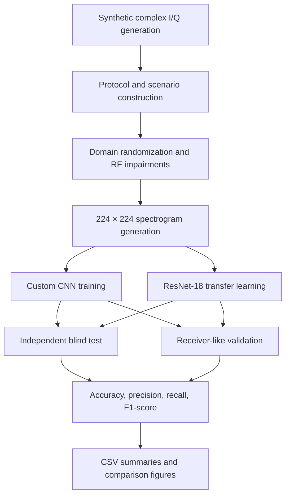
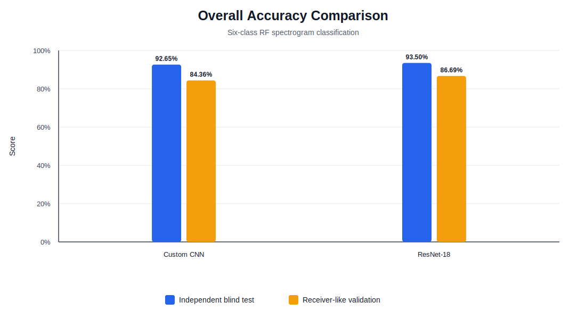
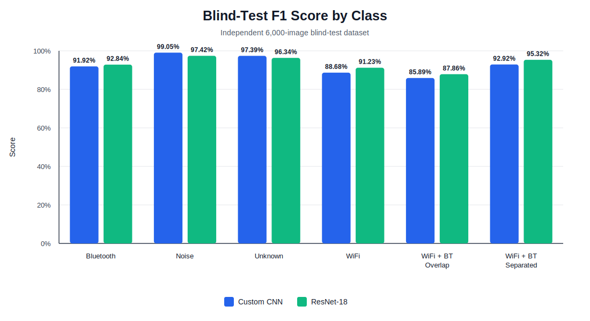
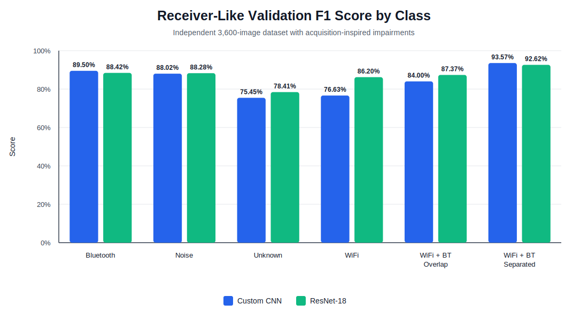

# RF Signal Classification for WiFi and Bluetooth Coexistence

MATLAB project for classifying radio-frequency activity from spectrogram images generated from complex I/Q observations. The system distinguishes WiFi, Bluetooth, WiFi–Bluetooth coexistence, receiver-like noise, and unknown RF-like activity using two image-classification models:

- a custom convolutional neural network trained from scratch;
- a ResNet-18 transfer-learning model adapted to the six RF classes.

The repository contains the complete synthetic data-generation workflow, pretrained model files, independent evaluation scripts, result tables, and reproducibility documentation. The reported results can be reviewed without retraining, while the datasets and evaluations can also be regenerated from the included MATLAB scripts.

> **Data scope:** all performance values reported in this repository are based on synthetic datasets. The receiver-like validation set uses acquisition-inspired impairments, but it is not presented as a hardware-capture dataset.

## Contents

- [Project objective](#project-objective)
- [Classification classes](#classification-classes)
- [System workflow](#system-workflow)
- [Dataset design](#dataset-design)
- [Signal and coexistence generation](#signal-and-coexistence-generation)
- [Spectrogram representation](#spectrogram-representation)
- [Models](#models)
- [Results](#results)
- [Result interpretation](#result-interpretation)
- [MATLAB requirements](#matlab-requirements)
- [Quick evaluation](#quick-evaluation)
- [Full reproduction workflow](#full-reproduction-workflow)
- [Generated artifacts](#generated-artifacts)
- [Repository structure](#repository-structure)
- [Limitations and future work](#limitations-and-future-work)
- [License](#license)

## Project objective

The objective is to classify a complete RF observation window into one of six categories from its time-frequency representation. Instead of relying only on received power or a single spectral peak, the models learn visual patterns associated with:

- occupied bandwidth;
- frequency displacement;
- spectral overlap and separation;
- intermittent or burst-like activity;
- coexistence between WiFi and Bluetooth;
- receiver-like noise and distortion;
- RF-like structures outside the target protocol classes.

Each observation is converted into a normalized 224 × 224 spectrogram and assigned one image-level label. The project does not perform pixel-level segmentation or open-set recognition.

## Classification classes

| Class | Description |
| --- | --- |
| `Bluetooth` | Bluetooth Low Energy activity with randomized frequency position, burst behavior, and RF impairments. |
| `Noise` | Complex receiver-like noise including colored components, DC leakage, bursts, and weak spurious tones. |
| `Unknown` | Synthetic RF-like activity outside the target WiFi and Bluetooth classes, including narrowband, multitone, chirp, FSK, and non-WiFi OFDM structures. |
| `WiFi` | IEEE 802.11 non-HT waveform generated with MATLAB WLAN functions. |
| `WiFi_Bluetooth_Overlap` | WiFi and Bluetooth activity occupying overlapping or nearby spectral regions. |
| `WiFi_Bluetooth_Separated` | WiFi and Bluetooth activity present in the same observation but separated in frequency. |

## System workflow



The workflow is divided into separate generation, training, and evaluation stages so that each dataset can be regenerated independently and the included pretrained models can be evaluated without retraining.

## Dataset design

All three datasets are synthetic and use the same six class names, but they are generated independently for different purposes.

| Dataset | Classes | Samples per class | Total | Purpose |
| --- | ---: | ---: | ---: | --- |
| Domain-randomized training set | 6 | 3,000 | 18,000 | Model training, validation, and internal testing |
| Independent blind test | 6 | 1,000 | 6,000 | Final evaluation on separately generated observations |
| Receiver-like validation | 6 | 600 | 3,600 | Robustness evaluation under stronger acquisition-inspired effects |

Canonical generated-data locations:

```text
data/spectrograms_v3_domain_randomized
data/blind_test_v2_final
data/receiver_like_validation/spectrograms
```

Large generated datasets are not required to be committed to the repository. They can be reconstructed with the scripts in `matlab/`.

### Training dataset

The training set uses domain randomization to reduce dependence on fixed spectral positions or ideal signal conditions. Randomized effects include:

- signal-to-noise ratio;
- carrier-frequency offset;
- phase and amplitude variation;
- multipath effects;
- IQ imbalance;
- DC offset;
- colored noise;
- time shifts;
- weak tones and spurious components;
- randomized Bluetooth-to-WiFi relative power;
- continuous frequency placement of Bluetooth and unknown signals.

### Independent blind test

The blind test is generated separately from the training set and uses a different random seed. It is not used for model optimization and serves as the principal final test of generalization under a related synthetic distribution.

### Receiver-like validation

The receiver-like dataset is a second independent synthetic validation set. It applies an additional acquisition-inspired chain containing:

- randomized SNR;
- programmed frequency displacement;
- fine oscillator mismatch;
- multipath;
- IQ imbalance;
- DC leakage;
- simulated receiver gain;
- clipping;
- ADC quantization;
- colored noise, bursts, and weak spurious components.

Its metadata stores controlled generation values such as SNR, simulated gain, frequency offsets, seed, dataset version, and repository-relative file paths.

The canonical generator is:

```matlab
run("matlab/step04_generate_receiver_like_validation.m")
```

It uses a fixed seed, verifies all six class folders, checks the expected image count, and writes:

```text
data/receiver_like_validation/metadata_receiver_like_validation.csv
data/receiver_like_validation/generation_config_receiver_like.csv
```

## Signal and coexistence generation

### WiFi

WiFi observations use `wlanNonHTConfig` and `wlanWaveformGenerator`. Modulation and payload length are randomized before resampling to the common observation rate.

### Bluetooth

Bluetooth observations use `bleWaveformGenerator` in LE1M mode. The waveform is resampled and placed at a randomized position inside the observed spectrum.

### Coexistence cases

For WiFi–Bluetooth coexistence, both signals are:

1. generated independently;
2. resampled to a common 40 MS/s observation rate;
3. translated explicitly in complex baseband;
4. normalized independently;
5. combined with randomized relative power;
6. passed through the selected impairment chain.

The final implementation does not require `comm.MultibandCombiner`. Explicit complex frequency translation and baseband addition provide direct control over spectral overlap, separation, and relative signal strength.

### Unknown and noise classes

The `Unknown` class intentionally contains multiple RF-like structures that are not members of the WiFi or Bluetooth target classes. The `Noise` class includes receiver-like background conditions, colored components, DC leakage, transient bursts, and weak interferers.

## Spectrogram representation

Each complex I/Q observation is converted into a centered short-time Fourier transform and normalized to a grayscale image:

```text
Input I/Q observation
        ↓
Windowed spectrogram
        ↓
Log-magnitude scaling
        ↓
Dynamic-range clipping and normalization
        ↓
224 × 224 grayscale image
```

The representation preserves:

- time-frequency occupancy;
- occupied bandwidth;
- relative frequency placement;
- overlap and separation;
- intermittent activity;
- noise-like structures;
- unknown RF patterns.

The custom CNN consumes grayscale images directly. ResNet-18 receives the same images converted to RGB during preprocessing.

## Models

### Custom CNN baseline

Model file:

```text
models/cnn_wifi_bluetooth_v3_domain_randomized.mat
```

Training script:

```matlab
run("matlab/step02_train_cnn_wifi_bluetooth.m")
```

The network is trained from scratch and provides the project baseline.

### ResNet-18 transfer learning

Model file:

```text
models/resnet18_transfer_learning_wifi_bluetooth.mat
```

Training script:

```matlab
run("matlab/step02b_train_transfer_learning_wifi_bluetooth.m")
```

The pretrained ResNet-18 feature extractor is adapted to the six spectrogram classes. Grayscale images are converted to RGB before classification.

## Results

### Overall accuracy

| Model | Independent blind test | Receiver-like validation |
| --- | ---: | ---: |
| Custom CNN baseline | **92.65%** | **84.36%** |
| ResNet-18 transfer learning | **93.50%** | **86.69%** |

ResNet-18 improves accuracy by:

- **0.85 percentage points** on the independent blind test;
- **2.33 percentage points** on the receiver-like validation set.



### Independent blind-test results

The blind test contains 6,000 images: 1,000 independently generated observations per class.

#### Custom CNN

| Class | Precision | Recall | F1-score |
| --- | ---: | ---: | ---: |
| Bluetooth | 0.9115 | 0.9270 | 0.9192 |
| Noise | 0.9861 | 0.9950 | 0.9905 |
| Unknown | 0.9969 | 0.9520 | 0.9739 |
| WiFi | 0.8104 | 0.9790 | 0.8868 |
| WiFi_Bluetooth_Overlap | 0.9437 | 0.7880 | 0.8589 |
| WiFi_Bluetooth_Separated | 0.9406 | 0.9180 | 0.9291 |

#### ResNet-18

| Class | Precision | Recall | F1-score |
| --- | ---: | ---: | ---: |
| Bluetooth | 0.9575 | 0.9010 | 0.9284 |
| Noise | 0.9497 | 1.0000 | 0.9742 |
| Unknown | 0.9947 | 0.9340 | 0.9634 |
| WiFi | 0.8473 | 0.9880 | 0.9123 |
| WiFi_Bluetooth_Overlap | 0.9091 | 0.8500 | 0.8786 |
| WiFi_Bluetooth_Separated | 0.9700 | 0.9370 | 0.9532 |



### Receiver-like validation results

The receiver-like set contains 3,600 images: 600 observations per class with stronger acquisition-inspired effects.

#### Custom CNN

| Class | Precision | Recall | F1-score |
| --- | ---: | ---: | ---: |
| Bluetooth | 0.8447 | 0.9517 | 0.8950 |
| Noise | 0.8978 | 0.8633 | 0.8802 |
| Unknown | 0.6641 | 0.8733 | 0.7545 |
| WiFi | 0.8393 | 0.7050 | 0.7663 |
| WiFi_Bluetooth_Overlap | 0.9056 | 0.7833 | 0.8400 |
| WiFi_Bluetooth_Separated | 0.9925 | 0.8850 | 0.9357 |

#### ResNet-18

| Class | Precision | Recall | F1-score |
| --- | ---: | ---: | ---: |
| Bluetooth | 0.8902 | 0.8783 | 0.8842 |
| Noise | 0.8806 | 0.8850 | 0.8828 |
| Unknown | 0.7229 | 0.8567 | 0.7841 |
| WiFi | 0.8402 | 0.8850 | 0.8620 |
| WiFi_Bluetooth_Overlap | 0.9370 | 0.8183 | 0.8737 |
| WiFi_Bluetooth_Separated | 0.9796 | 0.8783 | 0.9262 |



The source CSV files for all values are stored under `results/`.

## Result interpretation

The blind-test results show strong performance for both models, with all class F1 scores above approximately 0.85. The receiver-like dataset is more difficult and produces a clear reduction in overall accuracy, which is expected because it introduces a larger distribution shift.

Important observations:

- ResNet-18 gives the best overall accuracy on both evaluation sets.
- The largest ResNet-18 improvement on receiver-like data occurs for `WiFi`, whose F1-score increases from **0.7663** to **0.8620**.
- ResNet-18 also improves `Unknown` and `WiFi_Bluetooth_Overlap`, two of the most ambiguous receiver-like classes.
- The custom CNN remains slightly stronger for receiver-like `Bluetooth` and `WiFi_Bluetooth_Separated`.
- `Unknown` is the most difficult receiver-like class because it intentionally includes a broad range of RF-like structures and can resemble weak protocol activity or noise.
- The difference between blind-test and receiver-like accuracy demonstrates that robustness under stronger acquisition effects remains a meaningful challenge.

These results support using ResNet-18 as the preferred model when robustness is more important, while the custom CNN remains a useful compact baseline.

## MATLAB requirements

Depending on the selected workflow, the project uses:

- MATLAB;
- Deep Learning Toolbox;
- WLAN Toolbox;
- Bluetooth Toolbox;
- Communications Toolbox;
- Signal Processing Toolbox;
- Image Processing Toolbox;
- Statistics and Machine Learning Toolbox;
- Deep Learning Toolbox Model for ResNet-18 Network.

The optional future hardware-capture utility also requires the Communications Toolbox Support Package for USRP Radio, but it is not needed to reproduce the reported results.

## Quick evaluation

The pretrained model files are included. After placing or generating the evaluation datasets in a supported location, run:

```matlab
run("matlab/step07_run_all_evaluations.m")
```

This executes:

```matlab
run("matlab/step05_evaluate_blind_test.m")
run("matlab/step05b_evaluate_transfer_learning_blind_test.m")
run("matlab/step06_evaluate_cnn_receiver_like.m")
run("matlab/step06b_evaluate_transfer_learning_receiver_like.m")
```

The scripts resolve the repository root with `mfilename("fullpath")`, so they do not depend on a specific MATLAB current working directory.

## Full reproduction workflow

### 1. Clone or download the repository

Open the repository in MATLAB and confirm that the required toolboxes are installed.

### 2. Test signal generation

```matlab
run("matlab/step00_test_wifi_bluetooth_generation.m")
```

### 3. Generate the 18,000-image training dataset

```matlab
run("matlab/step01_generate_dataset_wifi_bluetooth.m")
```

Expected output:

```text
data/spectrograms_v3_domain_randomized
```

### 4. Train the custom CNN

```matlab
run("matlab/step02_train_cnn_wifi_bluetooth.m")
```

### 5. Train ResNet-18

```matlab
run("matlab/step02b_train_transfer_learning_wifi_bluetooth.m")
```

### 6. Generate the 6,000-image blind test

```matlab
run("matlab/step03_generate_blind_test.m")
```

Expected output:

```text
data/blind_test_v2_final
```

### 7. Generate the 3,600-image receiver-like validation set

```matlab
run("matlab/step04_generate_receiver_like_validation.m")
```

Expected output:

```text
data/receiver_like_validation/spectrograms
```

### 8. Evaluate both models

```matlab
run("matlab/step07_run_all_evaluations.m")
```

See [REPRODUCIBILITY.md](REPRODUCIBILITY.md) for seeds, expected counts, compatibility paths, and verification steps.

## Generated artifacts

Evaluation scripts write standardized files to `results/`.

### Custom CNN: blind test

```text
metrics_cnn_blind_test.csv
summary_cnn_blind_test.csv
confusion_matrix_cnn_blind_test.png
blind_test_results_cnn_baseline.mat
```

### ResNet-18: blind test

```text
metrics_transfer_learning_blind_test.csv
summary_transfer_learning_blind_test.csv
confusion_matrix_transfer_learning_blind_test.png
blind_test_results_transfer_learning.mat
```

### Custom CNN: receiver-like validation

```text
metrics_cnn_receiver_like.csv
summary_cnn_receiver_like.csv
confusion_matrix_cnn_receiver_like.png
receiver_like_results_cnn_baseline.mat
```

### ResNet-18: receiver-like validation

```text
metrics_transfer_learning_receiver_like.csv
summary_transfer_learning_receiver_like.csv
confusion_matrix_transfer_learning_receiver_like.png
receiver_like_results_transfer_learning.mat
```

The comparison figures embedded in this README are stored in:

```text
results/figures/
```

## Repository structure

```text
rf-signal-classification-wifi-bluetooth-ai/
├── README.md
├── REPRODUCIBILITY.md
├── LICENSE
├── matlab/
│   ├── step00_test_wifi_bluetooth_generation.m
│   ├── step01_generate_dataset_wifi_bluetooth.m
│   ├── step02_train_cnn_wifi_bluetooth.m
│   ├── step02b_train_transfer_learning_wifi_bluetooth.m
│   ├── step03_generate_blind_test.m
│   ├── step04_generate_receiver_like_validation.m
│   ├── step05_evaluate_blind_test.m
│   ├── step05b_evaluate_transfer_learning_blind_test.m
│   ├── step06_evaluate_cnn_receiver_like.m
│   ├── step06b_evaluate_transfer_learning_receiver_like.m
│   ├── step07_run_all_evaluations.m
│   └── step11_usrp_b210_real_capture.m
├── models/
│   ├── cnn_wifi_bluetooth_v3_domain_randomized.mat
│   ├── resnet18_transfer_learning_wifi_bluetooth.mat
│   └── README.md
├── data/
│   └── README.md
└── results/
    ├── README.md
    ├── figures/
    │   ├── model_accuracy_comparison.svg
    │   ├── blind_test_f1_comparison.svg
    │   └── receiver_like_f1_comparison.svg
    ├── metrics_*.csv
    └── summary_*.csv
```

## Limitations and future work

- All reported results are based on synthetic datasets.
- Receiver-like validation models acquisition-inspired effects but does not establish hardware-capture performance.
- The `Unknown` class is intentionally broad and does not constitute formal open-set recognition.
- Classification is performed for a complete spectrogram image rather than localizing individual signals.
- Remaining work includes improving robustness under larger distribution shifts and evaluating the workflow with independently labeled hardware captures when suitable equipment is available.

## License

See [LICENSE](LICENSE).
