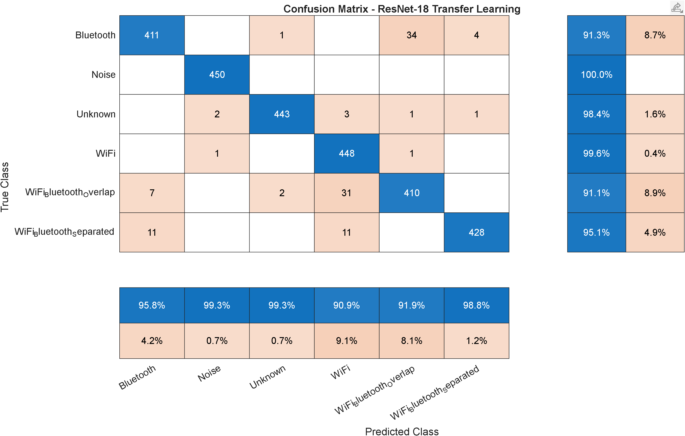

# RF Signal Classification Using AI: WiFi and Bluetooth Coexistence

This repository presents a MATLAB-based deep learning project for RF signal classification in WiFi and Bluetooth coexistence scenarios. The system converts complex I/Q waveforms into spectrogram images and classifies each observation into one of six RF signal categories.

The project includes two model workflows:

1. **Custom CNN baseline** trained from scratch.
2. **ResNet-18 transfer learning** using a pretrained convolutional neural network adapted to the RF spectrogram classification task.

The workflow includes synthetic I/Q waveform generation, domain-randomized dataset creation, model training, independent blind-test evaluation, real SDR validation using USRP B210 captures, metrics, and confusion matrices.

---

## Table of Contents

* [1. Project Objective](#1-project-objective)
* [2. Classification Problem](#2-classification-problem)
* [3. Signal Classes](#3-signal-classes)
* [4. System Workflow](#4-system-workflow)
* [5. Dataset Design](#5-dataset-design)
* [6. Spectrogram Representation](#6-spectrogram-representation)
* [7. RF Impairments and Domain Randomization](#7-rf-impairments-and-domain-randomization)
* [8. Models](#8-models)
* [9. Main Results](#9-main-results)
* [10. Custom CNN Baseline Results](#10-custom-cnn-baseline-results)
* [11. ResNet-18 Transfer Learning Results](#11-resnet-18-transfer-learning-results)
* [12. Real SDR Image Validation](#12-real-sdr-image-validation)
* [13. Reproducibility Guide](#13-reproducibility-guide)
* [14. Repository Structure](#14-repository-structure)
* [15. Generated Outputs](#15-generated-outputs)
* [16. Review Feedback Addressed](#16-review-feedback-addressed)
* [17. Notes and Limitations](#17-notes-and-limitations)
* [18. Large Files](#18-large-files)
* [19. License](#19-license)

---

## 1. Project Objective

The objective of this project is to build and evaluate an AI-based RF signal classifier capable of identifying WiFi, Bluetooth, noise, unknown RF-like activity, and WiFi-Bluetooth coexistence conditions from spectrogram images.

The project focuses on **spectrum-sensing classification**. Instead of relying only on received power or RSSI, the classifier learns time-frequency patterns such as:

* Occupied bandwidth
* Frequency displacement
* Spectral overlap
* Signal coexistence
* Noise-like behavior
* Unknown RF structures
* Receiver-like impairments

The system follows the technical goal of classifying RF signal activity using AI and spectrogram-based deep learning.

---

## 2. Classification Problem

The input to the classifier is a spectrogram image generated from a complex I/Q waveform segment.

The output is one class label:

```text
I/Q waveform  →  spectrogram image  →  trained classifier  →  RF class
```

This is an **image-level classification** problem. Each spectrogram corresponds to a complete RF observation window and receives one label.

This project does not perform pixel-level segmentation. It classifies the whole spectrogram image into one of six classes.

---

## 3. Signal Classes

| Class                      | Description                                                                                       |
| -------------------------- | ------------------------------------------------------------------------------------------------- |
| `Bluetooth`                | Bluetooth Low Energy waveform with frequency displacement and RF impairments.                     |
| `Noise`                    | Complex receiver-like noise, including colored noise, DC offset, weak bursts, and spurious tones. |
| `Unknown`                  | Synthetic RF-like signals that do not belong to the target WiFi or Bluetooth classes.             |
| `WiFi`                     | WLAN waveform generated using MATLAB WLAN functions.                                              |
| `WiFi_Bluetooth_Overlap`   | WiFi and Bluetooth activity occupying overlapping or nearby spectral regions.                     |
| `WiFi_Bluetooth_Separated` | WiFi and Bluetooth activity present in the same observation window but separated in frequency.    |

---

## 4. System Workflow

The complete workflow is organized as follows:

```text
Synthetic I/Q waveform generation
        ↓
RF impairments and domain randomization
        ↓
Spectrogram image generation
        ↓
Custom CNN baseline training
        ↓
ResNet-18 transfer-learning training
        ↓
Final independent blind-test evaluation
        ↓
Real SDR image validation using USRP B210 captures
        ↓
Metrics, confusion matrices, and model comparison
```

The repository includes scripts for:

* Testing WiFi and Bluetooth waveform generation
* Generating the synthetic training dataset
* Training a custom CNN baseline
* Training a ResNet-18 transfer-learning model
* Generating the final independent blind-test dataset
* Evaluating the custom CNN on the blind-test dataset
* Evaluating the transfer-learning model on the blind-test dataset
* Capturing real I/Q data using a USRP B210
* Evaluating both models on real SDR spectrogram images

---

## 5. Dataset Design

Large datasets are not included in this repository because of size.

The synthetic training and blind-test datasets can be regenerated using the MATLAB scripts in the `matlab/` folder.

The SDR validation dataset was generated from **real USRP B210 I/Q captures**. It is not simulated and can only be recreated with compatible SDR hardware and the Communications Toolbox Support Package for USRP Radio.

| Dataset                                  | Type              | Classes | Samples per class | Total samples | Purpose                                    |
| ---------------------------------------- | ----------------- | ------: | ----------------: | ------------: | ------------------------------------------ |
| `data/spectrograms_v3_domain_randomized` | Synthetic         |       6 |             3,000 |        18,000 | Training, validation, and internal testing |
| `data/blind_test_v2_final`               | Synthetic         |       6 |             1,000 |         6,000 | Final independent blind-test evaluation    |
| `data_sdr/spectrograms`                  | Real SDR captures |       6 |               600 |         3,600 | Additional SDR image validation            |

The training dataset and blind-test dataset are generated independently. The blind-test dataset is not used during training.

The real SDR dataset is not used for model training. It is used only as an additional validation stage to measure how the trained models behave on spectrogram images generated from real SDR I/Q captures.

---

## 6. Spectrogram Representation

Each complex I/Q segment is converted into a normalized spectrogram image.

The image size used by the project is:

```text
224 x 224
```

The spectrogram representation preserves key RF features, including:

* Time-frequency occupancy
* Bandwidth
* Spectral displacement
* Coexistence behavior
* Signal overlap
* Noise-like activity
* Unknown signal structure

For the custom CNN baseline, the spectrogram images are used as grayscale images.

For the ResNet-18 transfer-learning model, the grayscale spectrogram images are converted to RGB format during preprocessing because ResNet-18 expects an input size of:

```text
224 x 224 x 3
```

---

## 7. RF Impairments and Domain Randomization

To improve generalization, the synthetic waveform generation process includes randomized RF and receiver-like effects.

The implemented impairments include:

* Additive white Gaussian noise
* Frequency offset
* Random phase offset
* Amplitude variation
* Multipath channel effects
* IQ imbalance
* DC offset
* Colored noise
* Time shifts
* Noise bursts
* Weak spurious tones
* Variable Bluetooth-to-WiFi power ratio
* Continuous Bluetooth frequency displacement
* Continuous unknown-signal frequency displacement

This domain-randomized design helps prevent the model from memorizing fixed spectral positions and encourages it to learn more general RF patterns.

For WiFi-Bluetooth coexistence classes, both signals are resampled to a common sampling rate, digitally frequency-shifted, normalized, and then combined at complex baseband. This provides controlled overlap and separation cases for the classifier.

---

## 8. Models

Two model workflows are included.

---

### 8.1 Custom CNN Baseline

The custom CNN baseline is trained from scratch using the domain-randomized spectrogram dataset.

Main training script:

```matlab
run("matlab/step02_train_cnn_wifi_bluetooth.m")
```

Main blind-test evaluation script:

```matlab
run("matlab/step05_evaluate_blind_test.m")
```

Real SDR image evaluation script:

```matlab
run("matlab/step06a_evaluate_cnn_sdr_dataset.m")
```

Saved model:

```text
models/cnn_wifi_bluetooth_v3_domain_randomized.mat
```

This model provides the baseline performance of the project.

---

### 8.2 ResNet-18 Transfer Learning

The transfer-learning workflow uses ResNet-18 as a pretrained base network. The final classification layers are replaced and fine-tuned for the six RF spectrogram classes.

Training script:

```matlab
run("matlab/step02b_train_transfer_learning_wifi_bluetooth.m")
```

Blind-test evaluation script:

```matlab
run("matlab/step05b_evaluate_transfer_learning_blind_test.m")
```

Real SDR image evaluation script:

```matlab
run("matlab/step06_evaluate_transfer_learning_sdr_dataset.m")
```

Saved model:

```text
models/resnet18_transfer_learning_wifi_bluetooth.mat
```

The transfer-learning model is evaluated using the same final blind-test and real SDR spectrogram datasets as the custom CNN baseline.

---

## 9. Main Results

The following table summarizes the main model comparison.

| Model                       | Final blind-test accuracy | Real SDR image validation accuracy |
| --------------------------- | ------------------------: | ---------------------------------: |
| Custom CNN baseline         |                    92.65% |                             84.36% |
| ResNet-18 transfer learning |                    93.50% |                             86.69% |

The ResNet-18 transfer-learning model improved the final blind-test accuracy by:

```text
+0.85 percentage points
```

and improved the real SDR image validation accuracy by:

```text
+2.33 percentage points
```

compared with the custom CNN baseline.

---

## 10. Custom CNN Baseline Results

---

### 10.1 Final Independent Blind Test

The custom CNN baseline achieved:

```text
Final blind-test accuracy: 92.65%
```

Metrics by class:

| Class                    | Precision | Recall | F1-score |
| ------------------------ | --------: | -----: | -------: |
| Bluetooth                |    0.9115 | 0.9270 |   0.9192 |
| Noise                    |    0.9861 | 0.9950 |   0.9905 |
| Unknown                  |    0.9969 | 0.9520 |   0.9739 |
| WiFi                     |    0.8104 | 0.9790 |   0.8868 |
| WiFi_Bluetooth_Overlap   |    0.9437 | 0.7880 |   0.8589 |
| WiFi_Bluetooth_Separated |    0.9406 | 0.9180 |   0.9292 |

Confusion matrix:


Associated result files:

```text
results/metrics_blind_test_v3_final.csv
results/confusion_matrix_blind_test_v3_final.png
```

---

### 10.2 Real SDR Image Validation

The custom CNN baseline achieved:

```text
Real SDR image validation accuracy: 84.36%
```

Metrics by class:

| Class                    | Precision | Recall | F1-score |
| ------------------------ | --------: | -----: | -------: |
| Bluetooth                |    0.8447 | 0.9517 |   0.8950 |
| Noise                    |    0.8978 | 0.8633 |   0.8802 |
| Unknown                  |    0.6641 | 0.8733 |   0.7545 |
| WiFi                     |    0.8393 | 0.7050 |   0.7663 |
| WiFi_Bluetooth_Overlap   |    0.9056 | 0.7833 |   0.8400 |
| WiFi_Bluetooth_Separated |    0.9925 | 0.8850 |   0.9357 |

Confusion matrix:


Associated result files:

```text
results/metrics_cnn_sdr_dataset.csv
results/summary_cnn_sdr_dataset.csv
results/confusion_matrix_cnn_sdr_dataset.png
```

---

## 11. ResNet-18 Transfer Learning Results

---

### 11.1 Training Summary

The ResNet-18 transfer-learning model was trained using the domain-randomized spectrogram dataset.

Training configuration:

| Parameter              |     Value |
| ---------------------- | --------: |
| Base network           | ResNet-18 |
| Number of classes      |         6 |
| Maximum epochs         |        12 |
| Mini-batch size        |        64 |
| Initial learning rate  |      1e-4 |
| L2 regularization      |      1e-4 |
| Validation patience    |         6 |
| Validation accuracy    |    95.96% |
| Internal test accuracy |    95.93% |

Associated result files:

```text
results/summary_transfer_learning_training.csv
results/metrics_transfer_learning_internal_test.csv
results/confusion_matrix_transfer_learning_internal_test.png
```

Internal test metrics:

| Class                    | Precision | Recall | F1-score |
| ------------------------ | --------: | -----: | -------: |
| Bluetooth                |    0.9580 | 0.9133 |   0.9352 |
| Noise                    |    0.9934 | 1.0000 |   0.9967 |
| Unknown                  |    0.9933 | 0.9844 |   0.9888 |
| WiFi                     |    0.9087 | 0.9956 |   0.9502 |
| WiFi_Bluetooth_Overlap   |    0.9193 | 0.9111 |   0.9152 |
| WiFi_Bluetooth_Separated |    0.9884 | 0.9511 |   0.9694 |

Internal test confusion matrix:



---

### 11.2 Final Independent Blind Test

The ResNet-18 transfer-learning model achieved:

```text
Final blind-test accuracy: 93.50%
```

Metrics by class:

| Class                    | Precision | Recall | F1-score |
| ------------------------ | --------: | -----: | -------: |
| Bluetooth                |    0.9575 | 0.9010 |   0.9284 |
| Noise                    |    0.9497 | 1.0000 |   0.9742 |
| Unknown                  |    0.9947 | 0.9340 |   0.9634 |
| WiFi                     |    0.8473 | 0.9880 |   0.9123 |
| WiFi_Bluetooth_Overlap   |    0.9091 | 0.8500 |   0.8786 |
| WiFi_Bluetooth_Separated |    0.9700 | 0.9370 |   0.9532 |

Confusion matrix:


Associated result files:

```text
results/metrics_transfer_learning_blind_test.csv
results/summary_transfer_learning_blind_test.csv
results/confusion_matrix_transfer_learning_blind_test.png
```

---

### 11.3 Real SDR Image Validation

The ResNet-18 transfer-learning model achieved:

```text
Real SDR image validation accuracy: 86.69%
```

Metrics by class:

| Class                    | Precision | Recall | F1-score |
| ------------------------ | --------: | -----: | -------: |
| Bluetooth                |    0.8902 | 0.8783 |   0.8842 |
| Noise                    |    0.8806 | 0.8850 |   0.8828 |
| Unknown                  |    0.7229 | 0.8567 |   0.7841 |
| WiFi                     |    0.8402 | 0.8850 |   0.8620 |
| WiFi_Bluetooth_Overlap   |    0.9370 | 0.8183 |   0.8737 |
| WiFi_Bluetooth_Separated |    0.9796 | 0.8783 |   0.9262 |

Confusion matrix:


Associated result files:

```text
results/metrics_transfer_learning_sdr_dataset.csv
results/summary_transfer_learning_sdr_dataset.csv
results/confusion_matrix_transfer_learning_sdr_dataset.png
```

---

## 12. Real SDR Image Validation

The SDR image validation dataset contains spectrogram images generated from **real USRP B210 I/Q captures** and organized into the same six class folders.

Dataset path used for evaluation:

```text
data_sdr/spectrograms
```

Dataset summary:

| Class                    |   Samples |
| ------------------------ | --------: |
| Bluetooth                |       600 |
| Noise                    |       600 |
| Unknown                  |       600 |
| WiFi                     |       600 |
| WiFi_Bluetooth_Overlap   |       600 |
| WiFi_Bluetooth_Separated |       600 |
| **Total**                | **3,600** |

The real SDR dataset is not used for model training. It is used only as an additional validation dataset.

This validation stage is expected to be more difficult than the synthetic blind test because SDR captures may include:

* Hardware gain variation
* Receiver noise
* Frequency offsets
* Channel effects
* Capture artifacts
* Interference
* Conditions not fully represented in synthetic training

The real SDR dataset can be recreated using:

```matlab
run("matlab/step11_usrp_b210_real_capture.m")
```

Recreating this dataset requires compatible SDR hardware and the Communications Toolbox Support Package for USRP Radio.

The capture script saves:

```text
data_sdr/raw_iq/<ClassName>
data_sdr/spectrograms/<ClassName>
data_sdr/metadata_real_sdr_b210.csv
```

---

## 13. Reproducibility Guide

---

### 13.1 MATLAB Requirements

The project uses MATLAB and the following toolboxes or support packages depending on the script:

* MATLAB
* Deep Learning Toolbox
* WLAN Toolbox
* Bluetooth Toolbox
* Communications Toolbox
* Image Processing Toolbox
* Statistics and Machine Learning Toolbox
* Deep Learning Toolbox Model for ResNet-18 Network
* Communications Toolbox Support Package for USRP Radio, only for SDR capture scripts

---

### 13.2 Path Configuration

The scripts are intended to be executed from the repository root:

```matlab
cd("path/to/rf-signal-classification-wifi-bluetooth-ai")
```

Several evaluation scripts automatically detect the project directory using:

```matlab
scriptPath = mfilename("fullpath");
matlabDir = fileparts(scriptPath);
projectDir = fileparts(matlabDir);
```

For scripts that use `pwd`, make sure MATLAB is currently located at the repository root before running them.

---

### 13.3 Generate the Synthetic Training Dataset

```matlab
run("matlab/step01_generate_dataset_wifi_bluetooth.m")
```

This generates:

```text
data/spectrograms_v3_domain_randomized
```

Expected size:

```text
18,000 spectrogram images
```

---

### 13.4 Train the Custom CNN Baseline

```matlab
run("matlab/step02_train_cnn_wifi_bluetooth.m")
```

This saves:

```text
models/cnn_wifi_bluetooth_v3_domain_randomized.mat
```

A pretrained version of this model is included in the repository so reviewers can verify the reported results without retraining.

---

### 13.5 Generate the Final Independent Blind-Test Dataset

```matlab
run("matlab/step03_generate_blind_test.m")
```

This generates:

```text
data/blind_test_v2_final
```

Expected size:

```text
6,000 spectrogram images
```

---

### 13.6 Evaluate the Custom CNN Baseline

Final blind-test evaluation:

```matlab
run("matlab/step05_evaluate_blind_test.m")
```

Real SDR image validation:

```matlab
run("matlab/step06a_evaluate_cnn_sdr_dataset.m")
```

---

### 13.7 Train the ResNet-18 Transfer-Learning Model

```matlab
run("matlab/step02b_train_transfer_learning_wifi_bluetooth.m")
```

This saves:

```text
models/resnet18_transfer_learning_wifi_bluetooth.mat
```

A pretrained version of this model is included in the repository so reviewers can verify the reported results without retraining.

---

### 13.8 Evaluate the ResNet-18 Transfer-Learning Model

Final blind-test evaluation:

```matlab
run("matlab/step05b_evaluate_transfer_learning_blind_test.m")
```

Real SDR image validation:

```matlab
run("matlab/step06_evaluate_transfer_learning_sdr_dataset.m")
```

---

### 13.9 Capture Real SDR Data Using USRP B210

The repository includes a script for collecting real SDR I/Q captures using a USRP B210:

```matlab
run("matlab/step11_usrp_b210_real_capture.m")
```

This script is intended for passive RF data collection and requires compatible SDR hardware and MATLAB support packages.

The script saves raw I/Q captures and spectrogram images under:

```text
data_sdr/raw_iq/<ClassName>
data_sdr/spectrograms/<ClassName>
```

The final real SDR validation dataset used in this project contains 600 spectrogram images per class.

---

## 14. Repository Structure

```text
rf-signal-classification-wifi-bluetooth-ai/
├── README.md
├── LICENSE
├── .gitignore
├── matlab/
│   ├── step00_test_wifi_bluetooth_generation.m
│   ├── step01_generate_dataset_wifi_bluetooth.m
│   ├── step02_train_cnn_wifi_bluetooth.m
│   ├── step02b_train_transfer_learning_wifi_bluetooth.m
│   ├── step03_generate_blind_test.m
│   ├── step05_evaluate_blind_test.m
│   ├── step05b_evaluate_transfer_learning_blind_test.m
│   ├── step06a_evaluate_cnn_sdr_dataset.m
│   ├── step06_evaluate_transfer_learning_sdr_dataset.m
│   └── step11_usrp_b210_real_capture.m
├── models/
│   ├── cnn_wifi_bluetooth_v3_domain_randomized.mat
│   ├── resnet18_transfer_learning_wifi_bluetooth.mat
│   └── README.md
├── results/
│   ├── metrics_blind_test_v3_final.csv
│   ├── confusion_matrix_blind_test_v3_final.png
│   ├── metrics_cnn_sdr_dataset.csv
│   ├── summary_cnn_sdr_dataset.csv
│   ├── confusion_matrix_cnn_sdr_dataset.png
│   ├── metrics_transfer_learning_internal_test.csv
│   ├── summary_transfer_learning_training.csv
│   ├── confusion_matrix_transfer_learning_internal_test.png
│   ├── metrics_transfer_learning_blind_test.csv
│   ├── summary_transfer_learning_blind_test.csv
│   ├── confusion_matrix_transfer_learning_blind_test.png
│   ├── metrics_transfer_learning_sdr_dataset.csv
│   ├── summary_transfer_learning_sdr_dataset.csv
│   └── confusion_matrix_transfer_learning_sdr_dataset.png
├── data/
│   └── README.md
└── docs/
    └── validation_summary.md
```

---

## 15. Generated Outputs

The main reproducibility outputs are:

| File                                                           | Description                                |
| -------------------------------------------------------------- | ------------------------------------------ |
| `models/cnn_wifi_bluetooth_v3_domain_randomized.mat`           | Trained custom CNN baseline model.         |
| `models/resnet18_transfer_learning_wifi_bluetooth.mat`         | Trained ResNet-18 transfer-learning model. |
| `results/metrics_blind_test_v3_final.csv`                      | Custom CNN blind-test metrics.             |
| `results/metrics_cnn_sdr_dataset.csv`                          | Custom CNN real SDR validation metrics.    |
| `results/metrics_transfer_learning_internal_test.csv`          | ResNet-18 internal test metrics.           |
| `results/metrics_transfer_learning_blind_test.csv`             | ResNet-18 blind-test metrics.              |
| `results/metrics_transfer_learning_sdr_dataset.csv`            | ResNet-18 real SDR validation metrics.     |
| `results/confusion_matrix_blind_test_v3_final.png`             | Custom CNN blind-test confusion matrix.    |
| `results/confusion_matrix_cnn_sdr_dataset.png`                 | Custom CNN real SDR confusion matrix.      |
| `results/confusion_matrix_transfer_learning_internal_test.png` | ResNet-18 internal test confusion matrix.  |
| `results/confusion_matrix_transfer_learning_blind_test.png`    | ResNet-18 blind-test confusion matrix.     |
| `results/confusion_matrix_transfer_learning_sdr_dataset.png`   | ResNet-18 real SDR confusion matrix.       |


---

## 17. Notes and Limitations

* The training and blind-test datasets are generated synthetically from MATLAB I/Q waveforms.
* The real SDR image dataset is used only for validation, not training.
* Real SDR validation accuracy may be lower than synthetic blind-test accuracy because SDR captures can include hardware and environmental effects not fully represented in the synthetic dataset.
* The `Unknown` class is intentionally broad and can overlap visually with noise, weak Bluetooth-like activity, bursts, or other RF-like structures.
* The project performs image-level RF classification, not semantic segmentation.
* Raw I/Q datasets and large generated spectrogram datasets are not tracked in Git because of size.
* The included `.mat` model files allow reviewers to verify the reported results without retraining.

---

## 18. Large Files

Generated datasets and raw I/Q files are excluded from Git because of size.

The trained `.mat` model files are included in the `models/` folder so reviewers can verify the reported results without retraining.

If future model files exceed GitHub size limits, Git LFS should be used:

```bash
git lfs install
git lfs track "models/*.mat"
git add .gitattributes
```

---

## 19. License

This project is released under the BSD 2-Clause License. See the `LICENSE` file for details.
