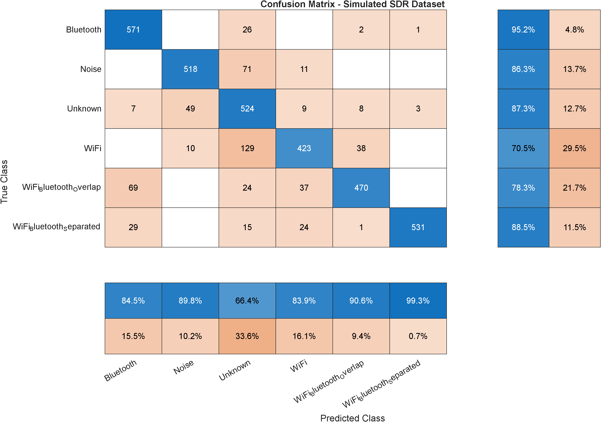

# Simulated SDR Validation

This document summarizes the simulated SDR validation stage of the RF signal classification project.

## Purpose

The simulated SDR dataset was created to evaluate the trained CNN under receiver-like conditions before using physical SDR hardware.

## Simulated Receiver Effects

- Receiver gain variation
- ADC-like quantization
- Frequency offset
- Phase offset
- Multipath channel effects
- IQ imbalance
- DC offset / LO leakage
- Colored receiver noise
- Burst-like signal activity

## Dataset Summary

| Dataset | Classes | Samples per class | Total samples |
|---|---:|---:|---:|
| Simulated SDR validation dataset | 6 | 600 | 3,600 |

## Results

| Class | Precision | Recall | F1-score |
|---|---:|---:|---:|
| Bluetooth | 0.8447 | 0.9517 | 0.8950 |
| Noise | 0.8978 | 0.8633 | 0.8802 |
| Unknown | 0.6641 | 0.8733 | 0.7545 |
| WiFi | 0.8393 | 0.7050 | 0.7663 |
| WiFi_Bluetooth_Overlap | 0.9056 | 0.7833 | 0.8400 |
| WiFi_Bluetooth_Separated | 0.9925 | 0.8850 | 0.9357 |

Overall simulated SDR validation accuracy: **84.36%**.

## Confusion Matrix

